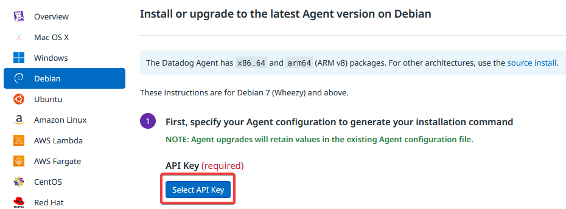
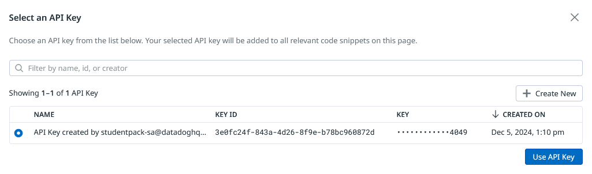
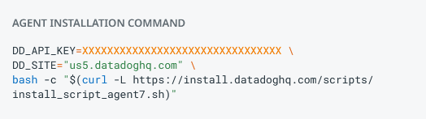
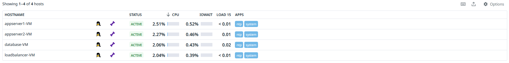
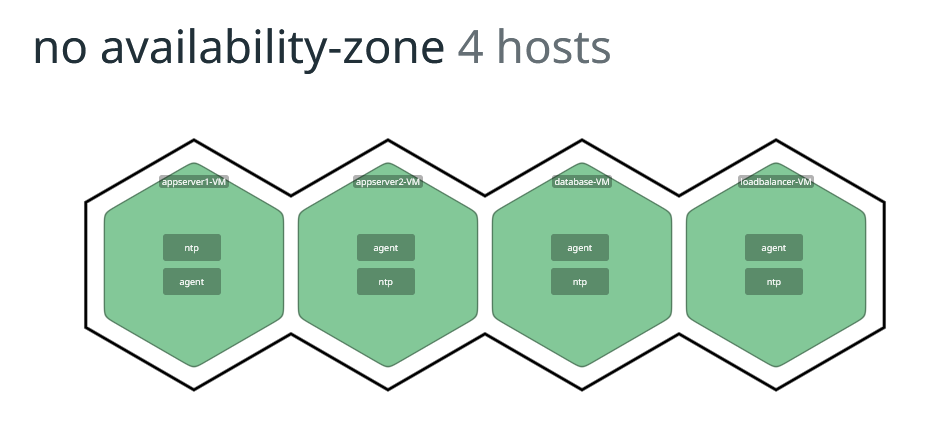
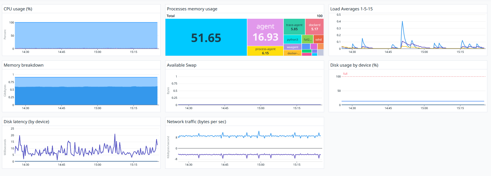

# Teknisk studie om Datadog

## Vad är datadog?

Datadog är en cloud baserad Saas som övervakar, ger en överblick och insiker i ens IT-infrastruktur och applikationer. Datadog samlar in data från de olika systemen och applikationer för att sedan visualisera detta i deras gränssnitt. Utifån detta kan man snabbt få en känsla kring hur systemen mår och presterar, hitta potential problem och kanske till och med förbättra effektiviteten. Datadogs huvudsakliga användningsområden är realtids övervakning av infrakstruktur och applikationer, logghantering, metrics och APM (Application Performance Monitoring) samt utskickning av varningar vid problem.

## Inkorporer datadog i Microblog

### Skapa konto

Skapa först ett konto på [Datadog](https://www.datadoghq.com/)

Om man är student och har tillgång till GitHub Student Pack kan du skapa ett konto här [Datadog - studentpack](https://studentpack.datadoghq.com/)

### Fixa API nyckel

Från dashboarden navigera **Integrations > Agent > Debian** och tryck på **Select API KEY**



Välj här nyckeln som skapades när vi gjode kontot



För att installera Datadogs agent på våra VMs behöver vi kommandet som återfinns på samma sida vi valde vilken api nyckel som ska användas. Detta kommand kan se ut på följande sätt:



### Installera Datadog på VM

Använd **SSH** för att koppla upp dig på en VM

Kör följande komman i terminalen på VM:en (använd det du kopierade från datadog)

```shell
DD_API_KEY=<api_key> \
DD_SITE="us5.datadoghq.com" \
bash -c "$(curl -L https://install.datadoghq.com/scripts/install_script_agent7.sh)"
```

### Datadog dashboard

För att nu se agenten vi precis skapade på VM:en tryck på **Infrastructure** så visas alla aktiva hosts, vilket skulle kunna se ut så här:



Du kan även se alla hosts på en karta **Infrastructure > Hosts > Host Map**



Om du trycker på en host ser du alternativet **View host in Dashboard** vilket ger en överblick kring de resuers som används i realtid. Detta skulle kunna se ut på följande sätt (min appserver1-VM):



### Automatisera installation av Datadog

För att automatisk installera Datadog på varje VM kan man skapa en **roll** i **ansible**

Skriv **Main.yml** på följande sätt:

```yml
---
- name: Install Datadog
  become: true
  shell: DD_API_KEY="{{ api_key }}" \
    DD_SITE="{{ url }}" \
    bash -c "$(curl -L https://install.datadoghq.com/scripts/install_script_agent7.sh)"
```

I mitt fall valde jag att köra denna roll efter all annan nödvändig programvara är installerade på VM:en. Till exempel ser min playbook för databasen ut så här:

```yml
---
- hosts: database
  remote_user: deploy
  become: yes
  become_method: sudo
  roles:
    - docker_install
    - docker_mysql
    - datadog
```

## Hur Datadog passar in och relatera till Devops

Datadog underlättar utvecklingen av CI/CD flöden genom att övervaka prestandan, vilket gör att man som utvecklare får en helthestbild i realtid hur t.ex den ny version presterar samt hur stabil den är i drift. En vikigt del av Devops är att få feedback från system och applikationer, Datadog tillhandahåller denna information genom insamling av data från infrastruktur, servrar, applikationer och databaser vilket gör att kan bilda sig en fullständig bild av hur systemen/systemet mår. Utifrån denna data kan man också hitta problem och identifiera potentiella flaskhalsar i realtid. Då Datadog är cloud baserat kan man lätt skala upp och ner vid behov för att hantera och övervaka diverse system.

Så med andra ord är Datadog ett bra verktyg för Devops när man behöver övervaka, analysera och hitta förbättrings punkter i sin applikation och infrastrukt på ett effektivt sätt. Datadog möjliggör för utvecklarna att vara mer förebyggande och kunna reagera snabbare när problem uppstår, vilket leder till snabbare leverans med högre kvalitet.
